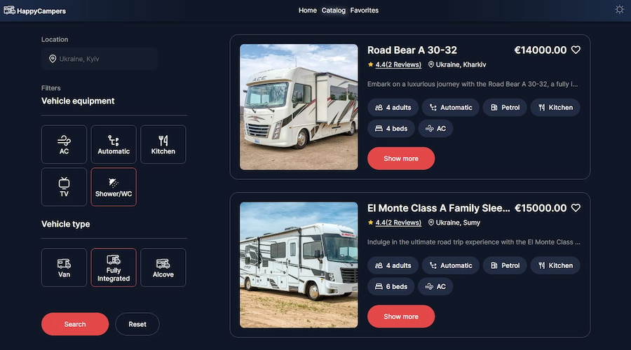

# HappyCampers

HappyCampers is a platform that provides campers for rent in different cities of
Ukraine.



## Installation

To set up the project locally, follow these steps:

1. Clone the repository to your local machine.
2. Install dependencies using npm or yarn:

```bash
npm install
```

3. Start the development server:

```bash
npm start
```

## Usage

Once the project is set up, you can browse through the catalog of campers, view
detailed information, and book them for rent.

## Features

- Browse campers by location and features
- View detailed information and reviews for each camper
- Book campers for rent
- Add campers to favorites for quick access

## Contributing

If you'd like to contribute to HappyCampers, please follow these guidelines:

- Submit bug reports or feature requests via GitHub issues.
- Fork the repository, make your changes, and submit a pull request.

## License

This project is licensed under the MIT License.

## Contact

For questions or support, contact us at `https://github.com/AliceBondMe`
